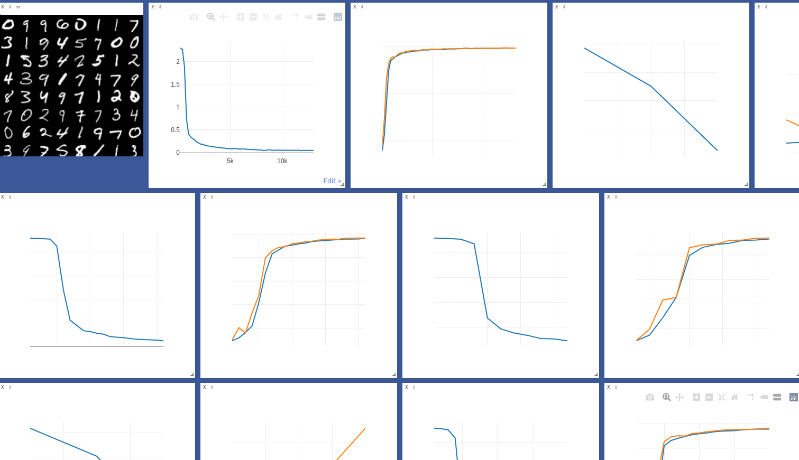

# introduce
Visualizing pytorch model with visdom tool
# ENV
ubuntu16.04 \
python3.6 \
torch>=1.4\
cuda10.1

pip install -i http://pypi.douban.com/simple/ \
--trusted-host pypi.douban.com scikit-image opencv-python mnist
# Download data
pip install visdom \
python -m visdom.server # 或者直接visdom\
down_datatses-->python vis_down_datas.py 
# train
python train.py 
# detect
python detect.py 





ImportError: /usr/lib/x86_64-linux-gnu/libstdc++.so.6: version `GLIBCXX_3.4.22' not found
```
strings /usr/lib/x86_64-linux-gnu/libstdc++.so.6 | grep GLIBCXX
sudo apt-get install libstdc++6
sudo add-apt-repository ppa:ubuntu-toolchain-r/test 
sudo apt-get update
sudo apt-get upgrade
sudo apt-get dist-upgrade 

locate libstdc++.so
export LD_LIBRARY_PATH=YOU_.so_PATH/lib:$LD_LIBRARY_PATH
strings /usr/lib/x86_64-linux-gnu/libstdc++.so.6 | grep GLIBCXX
.....
GLIBCXX_3.4.21
GLIBCXX_3.4.22
GLIBCXX_3.4.23
GLIBCXX_3.4.24
GLIBCXX_3.4.25
GLIBCXX_3.4.26
GLIBCXX_3.4.27
GLIBCXX_3.4.28
GLIBCXX_DEBUG_MESSAGE_LENGTH

```


# reference
https://github.com/fossasia/visdom
https://blog.csdn.net/llqzx/article/details/110100333
https://zhaojichao.blog.csdn.net/article/details/107579714
https://blog.csdn.net/shu15121856/article/details/88818539

[https://blog.csdn.net/llqzx/article/details/110097582](https://blog.csdn.net/llqzx/article/details/110097582)
https://blog.csdn.net/llqzx/article/details/110098813


